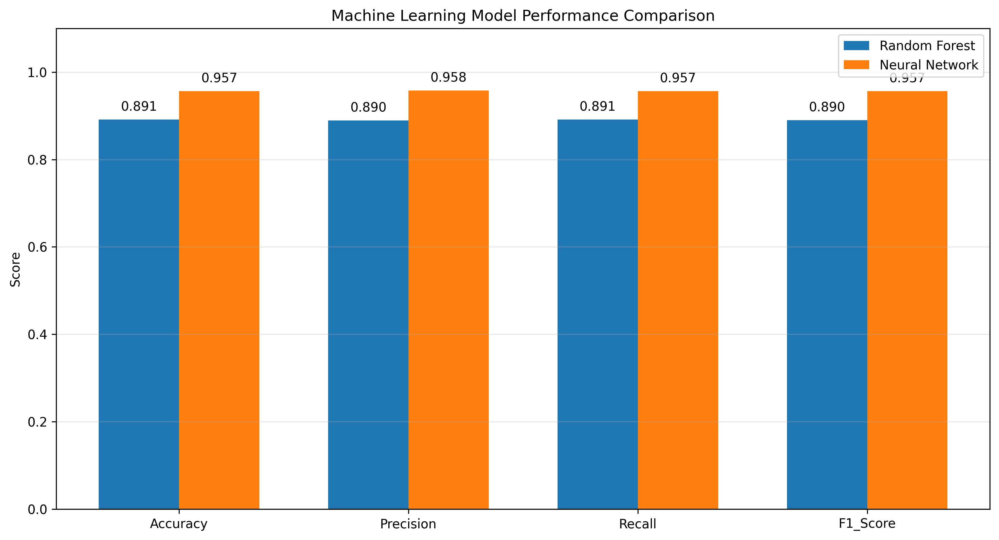

# AI-Based Vegetable Production Pattern Analysis

## Overview

This project focuses on **analyzing vegetable production patterns across different taluks using Machine Learning and Deep Learning techniques**.

The dataset contains production values for multiple important vegetable crops such as **Potato, Tomato, Brinjal, Beans, Onion, Green Chillies, Leafy Vegetables, Gourds, and other vegetables**.

The main objective of this project is to classify each taluk into one of three production categories:

- **Low Production**
- **Medium Production**
- **High Production**

The project compares the performance of a **Random Forest Classifier** and a **Neural Network model** using several evaluation metrics.

---

# Project Title

**AI-Based Vegetable Production Pattern Analysis Using Machine Learning and Neural Networks**

---

# Objective

The main objectives of this project are:

- Analyze vegetable production patterns across different taluks.
- Clean and preprocess agricultural production data.
- Calculate total vegetable production for every taluk.
- Categorize taluks into Low, Medium, and High production groups.
- Train a Random Forest classification model.
- Train a Neural Network classification model.
- Compare the performance of both models.
- Generate prediction results for all taluks.
- Identify important vegetable crops using feature importance.
- Save trained models for future prediction.
- Generate CSV reports and visualization graphs.

---

# Dataset

The dataset used in this project is:

```text
Production_of_Important_Vegetable_crops_In_Tonnes_2019_20.csv
```

The dataset contains **taluk-level vegetable production information for the agricultural year 2019–2020**.

The vegetable production quantities are represented in **tonnes**.

Each row represents a taluk, while the crop-related columns represent the production quantity of different vegetables.

---

# Dataset Features

The dataset contains a geographical identifier along with several vegetable-production attributes.

Example features include:

```text
Taluks
Potato
Tomato
Brinjal
Beans
Onion
Green Chillies
Leafy Vegetables
Gourds
Other Vegetable Crops
```

The `Taluks` column represents the geographical region.

The remaining columns contain vegetable-production quantities that are used as input features for the Machine Learning models.

---

# Problem Statement

Vegetable production can vary significantly between different geographical regions because of factors such as climate, irrigation facilities, soil conditions, crop selection, farming practices, and availability of agricultural resources.

Analyzing several vegetable-production variables manually can make it difficult to identify meaningful regional production patterns.

This project develops an **AI-based vegetable production analysis system** that uses Machine Learning and Neural Networks to classify taluks according to their overall vegetable-production level.

The classification categories are:

```text
Low Production
Medium Production
High Production
```

This classification provides a simple way of understanding and comparing vegetable-production patterns among different taluks.

---

# Project Workflow

The overall workflow of the project is:

```text
Vegetable Production Dataset
            |
            v
       Data Loading
            |
            v
       Data Cleaning
            |
            v
   Missing Value Handling
            |
            v
     Numeric Conversion
            |
            v
Calculate Total Vegetable Production
            |
            v
Generate Production Categories
            |
            v
   Low / Medium / High
            |
            v
      Feature Selection
            |
            v
      Train-Test Split
            |
      +-----+-----+
      |           |
      v           v
Random Forest   Neural Network
      |           |
      +-----+-----+
            |
            v
      Model Evaluation
            |
            v
Accuracy / Precision / Recall / F1
            |
            v
      Model Comparison
            |
            v
      Final Predictions
            |
            v
CSV Reports + Visualization Graphs
```

---

# Data Preprocessing

Several preprocessing operations are performed before training the models.

## Column Cleaning

Extra spaces are removed from the dataset column names.

```python
df.columns = df.columns.str.strip()
```

This prevents errors caused by inconsistent column formatting.

---

## Numeric Conversion

Crop-production columns are converted into numeric values.

```python
df[col] = pd.to_numeric(
    df[col],
    errors="coerce"
)
```

Invalid values are converted into missing values so they can be handled during preprocessing.

---

## Missing Value Handling

Missing crop-production values are replaced using the median of the corresponding feature.

```python
df[col] = df[col].fillna(
    df[col].median()
)
```

Median imputation is useful because agricultural production data can contain extreme values.

---

## Negative Value Handling

Negative vegetable-production values are not meaningful.

Therefore, negative values are converted to zero.

```python
df[col] = df[col].clip(lower=0)
```

---

# Total Vegetable Production

The total vegetable production of each taluk is calculated by adding all available crop-production values.

```python
df["Total_Vegetable_Production"] = df[crop_columns].sum(axis=1)
```

Conceptually:

```text
Total Vegetable Production
        =
Potato Production
        +
Tomato Production
        +
Brinjal Production
        +
Beans Production
        +
Onion Production
        +
Green Chilli Production
        +
Leafy Vegetable Production
        +
Gourd Production
        +
Other Vegetable Production
```

The resulting value represents the overall vegetable-production quantity of a taluk.

---

# Production Category Generation

The calculated total production is used to generate the target variable:

```text
Production_Category
```

Production categories are generated using approximately the 33rd and 66th percentiles of total vegetable production.

```text
Bottom 33%     -> Low Production
Middle 33%     -> Medium Production
Top 34%        -> High Production
```

The implementation is:

```python
q1 = df["Total_Vegetable_Production"].quantile(0.33)
q2 = df["Total_Vegetable_Production"].quantile(0.66)
```

The category is then assigned as:

```python
def production_category(value):

    if value <= q1:
        return "Low"

    elif value <= q2:
        return "Medium"

    else:
        return "High"
```

---

# Target Variable

The target variable used for classification is:

```text
Production_Category
```

The three target classes are:

```text
Low
Medium
High
```

The labels are converted into numerical values using:

```python
LabelEncoder()
```

This allows the classification algorithms to process the categorical target.

---

# Target Leakage Prevention

An important consideration in this project is **target leakage**.

The target variable is generated using:

```text
Total_Vegetable_Production
```

Therefore, `Total_Vegetable_Production` is **not included as an input feature during model training**.

The model receives only the individual crop-production variables.

If total production were included as an input feature, the model would effectively receive the information used to construct the target category.

This could produce artificially high model accuracy and unreliable evaluation results.

---

# Train-Test Split

The dataset is divided into training and testing sets.

```python
train_test_split(
    X,
    y,
    test_size=0.20,
    random_state=42,
    stratify=y
)
```

The dataset is divided as:

```text
Training Data : 80%
Testing Data  : 20%
```

The `stratify` option helps preserve the distribution of Low, Medium, and High production categories in both sets.

---

# Machine Learning Models

Two models are developed and compared in this project:

1. **Random Forest Classifier**
2. **Artificial Neural Network**

---

# Random Forest Classifier

Random Forest is an ensemble Machine Learning algorithm that combines predictions from multiple decision trees.

The model used in this project is:

```python
RandomForestClassifier(
    n_estimators=300,
    random_state=42,
    class_weight="balanced"
)
```

## Advantages of Random Forest

Random Forest is suitable for this project because it:

- Performs well on structured tabular data.
- Handles nonlinear relationships.
- Can model interactions between different crops.
- Is relatively resistant to overfitting.
- Provides feature-importance values.
- Requires limited feature preprocessing.
- Can handle complex agricultural patterns.

The trained Random Forest model is saved as:

```text
vegetable_rf_model.pkl
```

---

# Neural Network Model

A feed-forward Artificial Neural Network is used as the second classification model.

The network architecture is:

```text
Input Layer
     |
     v
Dense Layer - 64 Neurons - ReLU
     |
     v
Dropout - 20%
     |
     v
Dense Layer - 32 Neurons - ReLU
     |
     v
Dropout - 10%
     |
     v
Dense Layer - 16 Neurons - ReLU
     |
     v
Output Layer - 3 Neurons - Softmax
```

The output layer represents the three production categories:

```text
Low
Medium
High
```

---

# Neural Network Configuration

The Neural Network uses:

```text
Optimizer        : Adam
Loss Function    : Categorical Crossentropy
Hidden Activation: ReLU
Output Activation: Softmax
```

The model is compiled using:

```python
nn_model.compile(
    optimizer="adam",
    loss="categorical_crossentropy",
    metrics=["accuracy"]
)
```

---

# Early Stopping

Early stopping is used during Neural Network training.

```python
EarlyStopping(
    monitor="val_loss",
    patience=15,
    restore_best_weights=True
)
```

This stops training when validation performance no longer improves and restores the best model weights.

It helps reduce unnecessary training and overfitting.

---

# Feature Scaling

The Neural Network uses standardized input features.

Feature scaling is performed using:

```python
StandardScaler()
```

The scaler is trained only on the training data.

```python
X_train_scaled = scaler.fit_transform(X_train)
X_test_scaled = scaler.transform(X_test)
```

The trained scaler is saved as:

```text
scaler.pkl
```

---

# Model Evaluation

Both Random Forest and Neural Network models are evaluated using multiple classification metrics.

The evaluation metrics include:

- **Accuracy**
- **Precision**
- **Recall**
- **F1-Score**
- **Confusion Matrix**

Using multiple metrics provides a more complete evaluation than relying only on accuracy.

---

# Accuracy

Accuracy represents the proportion of predictions that are correct.

```text
Accuracy =
Correct Predictions
-------------------
Total Predictions
```

Accuracy provides a general measurement of model performance.

---

# Precision

Precision measures how many samples predicted as a particular category actually belong to that category.

```text
Precision =
True Positive
----------------------------
True Positive + False Positive
```

Higher precision indicates fewer false-positive predictions.

---

# Recall

Recall measures how many samples belonging to a category were successfully identified.

```text
Recall =
True Positive
----------------------------
True Positive + False Negative
```

Higher recall means the model successfully identifies more relevant samples.

---

# F1-Score

The F1-score combines precision and recall.

```text
F1 Score =
2 × Precision × Recall
----------------------
Precision + Recall
```

It provides a balanced measurement of classification performance.

---

# Model Comparison

The performance of Random Forest and Neural Network is compared using:

```text
Accuracy
Precision
Recall
F1-Score
```

The comparison results are stored in:

```text
model_comparison.csv
```

---

# Model Comparison Visualization

The primary visualization used in this project is:

```text
model_comparison_graph.png
```

It compares the performance of the **Random Forest Classifier** and **Neural Network**.



The graph compares:

- Accuracy
- Precision
- Recall
- F1-Score

This visualization makes it easier to identify which model provides better overall classification performance.

---

# Accuracy Graph

The Neural Network training and validation accuracy is visualized using:

```text
accuracy_graph.png
```

The graph displays:

```text
Training Accuracy
vs
Validation Accuracy
```

across training epochs.

This visualization can help identify:

- Model convergence
- Training stability
- Overfitting
- Underfitting

---

# Confusion Matrix Heatmap

The Random Forest classification results are analyzed using a confusion matrix.

The generated visualization is:

```text
confusion_matrix_heatmap.png
```

The confusion matrix compares:

```text
Actual Production Category
vs
Predicted Production Category
```

Correct predictions appear along the main diagonal.

The matrix helps determine which production categories are most frequently confused by the model.

---

# Feature Importance Analysis

One advantage of Random Forest is its ability to estimate feature importance.

The feature-importance visualization is saved as:

```text
feature_importance_graph.png
```

Feature importance indicates how strongly individual vegetable-production features contribute to classification decisions.

Features with larger importance values have greater influence on the model's predictions.

This can help identify crops that play a major role in differentiating vegetable-production patterns among taluks.

---

# Result CSV

Model evaluation results for the held-out testing dataset are stored in:

```text
result.csv
```

The file contains information such as:

```text
Taluk
Total_Vegetable_Production
Actual_Category
Random_Forest_Prediction
Neural_Network_Prediction
RF_Correct
NN_Correct
```

This allows direct comparison between actual and predicted production categories.

---

# Result Graph

The testing results are visualized using:

```text
result_graph.png
```

The graph shows vegetable-production quantities for the taluks present in the testing dataset.

It provides a visual representation of the production differences between test regions.

---

# Prediction CSV

Predictions for the complete dataset are stored in:

```text
prediction.csv
```

The prediction file contains:

```text
Taluk
Total_Vegetable_Production
Actual_Category
RF_Predicted_Category
RF_Confidence_Percentage
NN_Predicted_Category
NN_Confidence_Percentage
Crop Production Features
```

This file provides predictions from both models along with their confidence scores.

---

# Prediction Graph

Prediction confidence is visualized using:

```text
prediction_graph.png
```

The graph compares:

```text
Random Forest Prediction Confidence
vs
Neural Network Prediction Confidence
```

for selected high-production taluks.

This visualization provides additional insight into how confident each model is in its predictions.

---

# Production Category Distribution

The distribution of predicted production categories is visualized using:

```text
production_category_distribution.png
```

This graph shows the number of taluks predicted as:

```text
Low
Medium
High
```

It provides an overview of the regional vegetable-production distribution.

---

# Saved Machine Learning Files

The project saves several trained model and preprocessing files.

## Random Forest Model

```text
vegetable_rf_model.pkl
```

Contains the trained Random Forest classification model.

---

## Neural Network Model

```text
vegetable_nn_model.h5
```

Contains the trained Artificial Neural Network.

---

## Feature Scaler

```text
scaler.pkl
```

Contains the fitted StandardScaler used by the Neural Network.

---

## Label Encoder

```text
label_encoder.pkl
```

Contains the encoder used to transform production categories into numerical labels.

---

# Configuration Files

The project also generates configuration and metadata files.

## YAML Configuration

```text
vegetable_project_config.yaml
```

The YAML file stores project information such as:

- Dataset details
- Feature names
- Production thresholds
- Model configuration
- Model performance
- Training settings

---

## JSON Metadata

```text
vegetable_model_metadata.json
```

The JSON file stores information such as:

- Project name
- Dataset information
- Input features
- Target classes
- Production thresholds
- Model performance
- Model filenames
- Feature importance

---

# Generated Files

After running the complete project, the directory can contain:

```text
AI-Based Vegetable Production Pattern Analysis/
│
├── Production_of_Important_Vegetable_crops_In_Tonnes_2019_20.csv
│
├── processed_vegetable_data.csv
│
├── vegetable_rf_model.pkl
├── vegetable_nn_model.h5
├── scaler.pkl
├── label_encoder.pkl
│
├── vegetable_project_config.yaml
├── vegetable_model_metadata.json
│
├── feature_importance.csv
├── neural_network_training_history.csv
│
├── accuracy_graph.png
├── confusion_matrix_heatmap.png
├── model_comparison_graph.png
├── feature_importance_graph.png
├── result_graph.png
├── prediction_graph.png
├── production_category_distribution.png
│
├── model_comparison.csv
├── result.csv
└── prediction.csv
```

---

# Project Directory Structure

```text
AI-Based Vegetable Production Pattern Analysis
│
├── Dataset
│   └── Production_of_Important_Vegetable_crops_In_Tonnes_2019_20.csv
│
├── Models
│   ├── vegetable_rf_model.pkl
│   ├── vegetable_nn_model.h5
│   ├── scaler.pkl
│   └── label_encoder.pkl
│
├── Configuration
│   ├── vegetable_project_config.yaml
│   └── vegetable_model_metadata.json
│
├── Results
│   ├── result.csv
│   ├── prediction.csv
│   ├── model_comparison.csv
│   └── feature_importance.csv
│
└── Visualizations
    ├── model_comparison_graph.png
    ├── accuracy_graph.png
    ├── confusion_matrix_heatmap.png
    ├── feature_importance_graph.png
    ├── result_graph.png
    ├── prediction_graph.png
    └── production_category_distribution.png
```

If all files are kept directly in the project root folder, the README image reference should remain:

```markdown

```

---

# Technologies Used

The project is developed using:

- **Python**
- **Pandas**
- **NumPy**
- **Scikit-learn**
- **TensorFlow**
- **Keras**
- **Matplotlib**
- **PyYAML**
- **Pickle**
- **JSON**

---

# Python Libraries

The main Python libraries required are:

```python
numpy
pandas
matplotlib
scikit-learn
tensorflow
pyyaml
```

---

# Installation

Install the required dependencies using:

```bash
pip install numpy pandas matplotlib scikit-learn tensorflow pyyaml
```

For Jupyter Notebook, use:

```python
!pip install numpy pandas matplotlib scikit-learn tensorflow pyyaml
```

---

# How to Run the Project

## Step 1: Download the Dataset

Place the dataset inside the project directory.

```text
Production_of_Important_Vegetable_crops_In_Tonnes_2019_20.csv
```

---

## Step 2: Set the Project Path

The project uses:

```python
BASE_DIR = r"C:\Users\sagni\Downloads\AI-Based Vegetable Production Pattern Analysis"
```

The dataset path is:

```python
CSV_PATH = os.path.join(
    BASE_DIR,
    "Production_of_Important_Vegetable_crops_In_Tonnes_2019_20.csv"
)
```

Modify `BASE_DIR` if the project is stored in another location.

---

## Step 3: Install Dependencies

Run:

```bash
pip install numpy pandas matplotlib scikit-learn tensorflow pyyaml
```

---

## Step 4: Run Model Training

Execute the training script or notebook.

The program will:

1. Load the vegetable-production dataset.
2. Clean the data.
3. Handle missing values.
4. Calculate total vegetable production.
5. Generate production categories.
6. Divide the data into training and testing sets.
7. Train Random Forest.
8. Train the Neural Network.
9. Evaluate both models.
10. Save the trained models.

---

## Step 5: Generate Results

Run the evaluation and visualization code.

It will generate:

```text
accuracy_graph.png
confusion_matrix_heatmap.png
model_comparison_graph.png
feature_importance_graph.png
result_graph.png
prediction_graph.png
production_category_distribution.png
```

It will also generate:

```text
result.csv
prediction.csv
model_comparison.csv
```

---

# Main Visualization

The primary visualization for presenting the model results is:

## Random Forest vs Neural Network Performance


The graph provides a direct comparison of the two models across multiple classification metrics.

This makes `model_comparison_graph.png` suitable for use in:

- GitHub README
- Project report
- Research presentation
- Academic documentation
- Model evaluation section

---

# Expected Outcome

The project produces an AI-based system capable of learning relationships between different vegetable-production features and regional production categories.

For every taluk, the system can provide a classification such as:

```text
Taluk: Example Taluk

Total Vegetable Production:
24500 tonnes

Actual Category:
High

Random Forest Prediction:
High

Random Forest Confidence:
94.5%

Neural Network Prediction:
High

Neural Network Confidence:
91.8%
```

The exact results depend on the dataset and trained models.

---

# Applications

The project can be useful for:

- Agricultural data analysis
- Regional crop-production profiling
- Vegetable-production pattern identification
- Agricultural planning
- Comparative regional analysis
- Crop importance analysis
- Data-driven agricultural research
- Machine Learning demonstrations using real agricultural data

---

# Advantages

The main advantages of this project include:

- Uses real agricultural production data.
- Combines Machine Learning and Deep Learning.
- Provides direct model comparison.
- Generates interpretable feature importance.
- Produces automated CSV reports.
- Generates publication-ready visualization files.
- Saves trained models for future use.
- Provides confidence scores for predictions.
- Prevents obvious target leakage by excluding total production from the input features.

---

# Limitations

The project also has several limitations.

## Single-Year Dataset

The dataset represents vegetable production for **2019–2020**.

Therefore, this project should primarily be interpreted as a **production-pattern classification and analysis system**, rather than a future forecasting system.

---

## Production-Based Features

The classification is based primarily on vegetable-production quantities.

Other agricultural factors are not included, such as:

- Rainfall
- Temperature
- Soil characteristics
- Irrigation availability
- Cultivated area
- Fertilizer usage
- Crop prices
- Agricultural infrastructure

Adding these features could improve future analysis.

---

## Derived Target

The Low, Medium, and High categories are generated from total production using quantile thresholds.

Therefore, these categories represent **relative production levels within the dataset** rather than official agricultural classifications.

---

## Dataset Size

The amount of available data can influence model performance.

Deep Learning models generally benefit from larger datasets, so the Neural Network should be interpreted carefully when the number of available taluks is limited.

---

# Future Enhancements

Several improvements can be added in future versions of the project.

## Multi-Year Analysis

Vegetable-production datasets from multiple years could be combined.

For example:

```text
2015-2016
2016-2017
2017-2018
2018-2019
2019-2020
2020-2021
2021-2022
```

This would allow analysis of production changes over time.

---

## Production Forecasting

With multiple years of historical data, forecasting models could be developed using:

- LSTM
- GRU
- XGBoost Regression
- Random Forest Regression
- Prophet
- Time-Series Transformers

---

## Agricultural Clustering

Unsupervised Machine Learning could be introduced using:

```text
K-Means
Hierarchical Clustering
DBSCAN
```

This could automatically discover groups such as:

```text
Onion-Dominant Regions
Tomato-Dominant Regions
Diversified Vegetable Producers
High-Production Regions
Low-Production Regions
```

---

## Explainable AI

Explainability methods such as **SHAP** could be added.

SHAP analysis could explain why a particular taluk was classified as Low, Medium, or High production.

This would improve model interpretability.

---

## Environmental Data Integration

Future versions could combine vegetable-production information with:

```text
Rainfall
Temperature
Humidity
Soil Type
Soil Moisture
Irrigation
Elevation
Land Area
```

This could provide a more comprehensive agricultural analysis.

---

## Geographic Visualization

Taluk coordinates or boundary data could be integrated with:

- GeoPandas
- Folium
- QGIS
- Plotly
- GIS shapefiles

This could create interactive maps showing vegetable-production patterns geographically.

---

## Web Application

The trained models could be deployed through:

```text
Streamlit
Flask
FastAPI
Django
```

A user could enter vegetable-production quantities and obtain:

```text
Predicted Production Category
Prediction Confidence
Feature Contribution
```

---

# Research Extension

The project can be extended into a research-oriented framework by combining:

```text
Vegetable Production Data
        +
Machine Learning Classification
        +
Deep Learning Classification
        +
Feature Importance
        +
Explainable AI
        +
Agricultural Clustering
```

A possible research title is:

**Machine Learning-Based Vegetable Production Profiling and Agricultural Productivity Classification Using Taluk-Level Crop Data**

Another possible title is:

**AI-Based Regional Vegetable Production Pattern Analysis Using Ensemble Learning and Neural Networks**

---

# Conclusion

This project demonstrates how **Machine Learning and Deep Learning can be applied to agricultural vegetable-production data to identify regional production patterns**.

The vegetable-production data is cleaned and transformed into meaningful features before the total production of each taluk is calculated.

The taluks are classified into:

```text
Low Production
Medium Production
High Production
```

Two predictive approaches are evaluated:

```text
Random Forest Classifier
Artificial Neural Network
```

Their performances are compared using:

```text
Accuracy
Precision
Recall
F1-Score
```

The primary model comparison is visualized through:


The project also generates confusion matrices, feature-importance analysis, prediction confidence graphs, result files, trained models, and configuration files.

Overall, the project provides a practical framework for **AI-assisted agricultural production analysis** and can serve as a foundation for more advanced agricultural analytics, Explainable AI, clustering, GIS-based visualization, and multi-year crop-production forecasting.

---

# Author

**Project:** AI-Based Vegetable Production Pattern Analysis

**Domain:** Artificial Intelligence / Machine Learning / Deep Learning / Agriculture

**Programming Language:** Python

**Dataset Period:** 2019–2020

---

# License

This project is intended primarily for:

- Academic research
- Educational purposes
- Machine Learning experimentation
- Agricultural data analysis

Users should verify the original dataset's licensing and usage requirements before using the dataset or derived results for commercial applications.

---

# Acknowledgement

This project demonstrates the application of **Artificial Intelligence, Machine Learning, and Neural Networks in agricultural data analysis**.

The vegetable-production dataset provides the foundation for studying regional production patterns and demonstrating how computational methods can support agricultural data interpretation.
